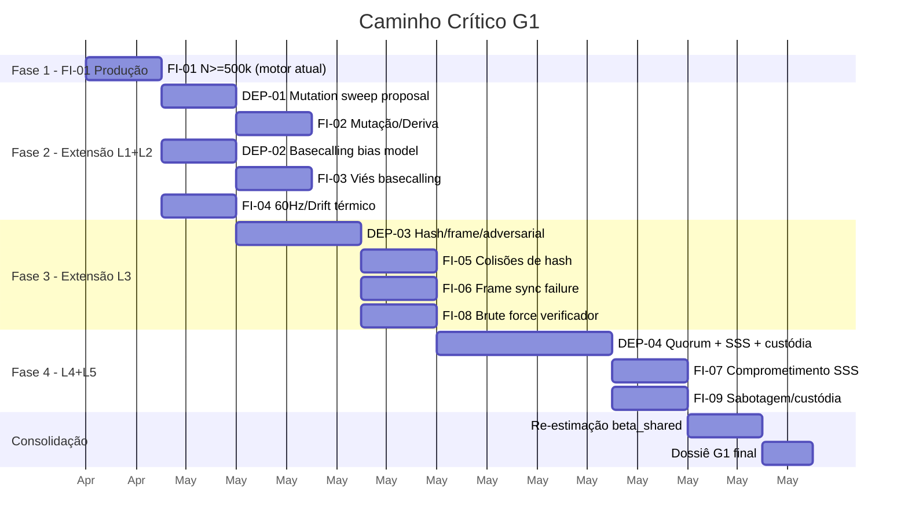

# Relatório de Alinhamento de Projeto — Sanguine Ledger v0.2.0

**Data:** 2026-04-26 | **Postura:** Engenheiro de Confiabilidade — Revisão Pré-Voo  
**Fontes:** Todos os Markdowns selados (G0) + Código v0.2.0 + Release Report  
**Objetivo:** Validar plano tático antes da execução G1

---

## 1. Mapeamento de Escopo Estrito (Campanhas × Camadas × Domínios × POs)

### 1.1 Tabela Mestra de Ativação

Derivada por cruzamento direto de `espec_G1 §4.2` (campanhas) com `espec_G1 §2.1` (camadas) e `modelo_ameacas §3.2` (domínios ε):

| Campanha | Ameaça | Camadas ATIVAS | Camadas ZERO/ISOLADAS | Domínios ε exercitados | POs alvo |
|---|---|---|---|---|---|
| **FI-01** | BIO-02 (burst/rearranjos) | L1, L2, L3 (verificador passivo) | **L4, L5** | $\epsilon_{ch}$, $\epsilon_{sync}$, $\epsilon_{ver}$ | PO-1 |
| **FI-02** | BIO-01/BIO-03 (mutação/deriva) | L1, L2 | **L3, L4, L5** | $\epsilon_{ch}$, $\epsilon_{cons}$† | PO-1, PO-3† |
| **FI-03** | INF-01 (viés basecalling) | L2, L1 (impacto indireto) | **L3, L4, L5** | $\epsilon_{ch}$, $\epsilon_{cons}$†, $\epsilon_{ops}$† | PO-1, PO-5 |
| **FI-04** | INF-03/INF-04 (60Hz/drift) | L2, L3 (estabilidade de decisão) | **L1 (passivo), L4, L5** | $\epsilon_{ch}$, $\epsilon_{ver}$, $\epsilon_{ops}$† | PO-5, PO-2 |
| **FI-05** | LOG-01 (colisões de hash) | L3 | **L1, L2, L4, L5** | $\epsilon_{sync}$, $\epsilon_{key}$ | PO-1, PO-4 |
| **FI-06** | LOG-02 (frame sync fail) | L1 (delimitadores), L3 | **L2, L4, L5** | $\epsilon_{sync}$, $\epsilon_{ver}$ | PO-1, PO-2 |
| **FI-07** | LOG-03 (comprometimento SSS) | **L4**, **L5** | L1, L2, L3 | $\epsilon_{key}$, $\epsilon_{ops}$ | PO-4, PO-5 |
| **FI-08** | LOG-04 (brute force verificador) | L3, **L4** (impacto em chave) | L1, L2, L5 | $\epsilon_{ver}$, $\epsilon_{adv}$, $\epsilon_{key}$† | PO-2, PO-4 |
| **FI-09** | OPS-01/OPS-03 (sabotagem) | **L5**, **L4** (impacto em consenso) | L1, L2, L3 | $\epsilon_{adv}$, $\epsilon_{ops}$, $\epsilon_{cons}$† | PO-5, PO-3 |

> **† Impacto secundário**: O domínio ε é afetado indiretamente (ex: drift correlacionado afeta $\epsilon_{cons}$ via $\beta_{substrato}$), mas a camada correspondente não executa lógica ativa — o impacto é medido como contribuição marginal em $\beta_{shared}$ durante pós-processamento.

### 1.2 Regra de Isolamento

> [!CAUTION]
> **Cada campanha FI deve exercitar APENAS as camadas listadas como ATIVAS.** As camadas marcadas como ZERO/ISOLADAS devem emitir indicadores zero durante a simulação. Misturar camadas ativas entre campanhas contamina a rastreabilidade ameaça→domínio→PO e invalida a evidência para auditoria.

### 1.3 Implicação direta para o quase-erro detectado

A tentativa de ativar L4/L5 dentro da FI-01 teria produzido:
- Contaminação de $\epsilon_{cons}$, $\epsilon_{key}$, $\epsilon_{ops}$ com ruído de burst errors (BIO-02), atribuindo erroneamente budget de consenso/operacional a uma ameaça de canal.
- Impossibilidade de isolar a contribuição de BIO-02 no orçamento $\epsilon_{ch} + \epsilon_{sync}$.
- Violação do princípio de rastreabilidade (espec_G1 §5): "cada evidência deve ser vinculada a uma PO e a um gate".

---

## 2. Detecção de Dependências Ocultas

### 2.1 Dependências Cruzadas Identificadas

| ID | Dependência | Campanhas afetadas | Impacto | Mitigação |
|---|---|---|---|---|
| **DEP-01** | FI-02 requer varredura paramétrica de $\mu$ (taxa de mutação) — o `config.py` atual expõe `p_mut_good` e `p_mut_bad` como fixos | FI-02 | Sem sweep de parâmetros, a evidência de sensibilidade para PO-1/PO-3 fica incompleta | Implementar `MutationSweepProposal` ou parametrizar `p_mut_*` na IS proposal |
| **DEP-02** | FI-03 requer modelo de viés de basecalling — não existe no `simulator.py` atual | FI-03 | Layer 2 não modela distorção sistemática por classe de base, apenas ruído estocástico | Adicionar operador de viés determinístico ao flip mask (bias por base A/T/G/C) |
| **DEP-03** | FI-05, FI-06, FI-08 requerem primitivas de Layer 3 que vão além do Verificador Híbrido — hash collision, frame sync corruption, adversarial queries | FI-05, FI-06, FI-08 | O `simulator.py` atual implementa apenas a decisão fail-stop do verificador, não os operadores de injeção de falha em hash/frame/adversarial | Implementar operadores de injeção específicos por campanha |
| **DEP-04** | FI-07, FI-09 requerem Layers 4-5 completas — quorum, SSS, proveniência | FI-07, FI-09 | Stubs atuais emitem zero; sem lógica real de consenso | Implementar simulação de quorum distribuído e cadeia de custódia |
| **DEP-05** | $\beta_{shared}$ é transversal a todas as campanhas (espec_G1 §4.3) — cada campanha deve medir contribuição marginal em $\rho_{ij}$ | Todas | O cálculo atual usa estimativas estáticas de $\beta_j$; após cada campanha, os valores devem ser **re-estimados** com base na correlação empírica observada | Implementar pós-processamento de correlação inter-nó por campanha |
| **DEP-06** | A Proposal IS deve ser recalibrada por campanha — cada FI requer uma distribuição de proposta diferente focada na sua classe de ameaça (espec_G1 §3.3) | Todas exceto FI-01 | Proposal-BIO atual é calibrada para burst (FI-01). Usar a mesma para FI-04 (drift) ou FI-08 (adversarial) resultaria em ESS degenerado | Criar Proposal-INFRA, Proposal-LOGIC, Proposal-OPS conforme §3.3 |

### 2.2 Dependências NÃO detectadas (Confirmação de independência)

| Verificação | Resultado |
|---|---|
| FI-01 depende de Layers 4-5? | ❌ **Não.** FI-01 é auto-contida em L1+L2+L3. |
| FI-01 em produção depende de outras campanhas? | ❌ **Não.** Pode ser executada imediatamente. |
| O motor estatístico precisa de alteração para FI-01 produção? | ❌ **Não.** `statistics.py` já implementa todos os estimadores necessários. |
| O formato JSON precisa mudar para FI-01 produção? | ❌ **Não.** O output atual já mapeia PO-1..PO-5 com G1 verdict. |

---

## 3. Roadmap de Execução — O Caminho Crítico

### 3.1 Fases de Implementação

### 3.2 Ordem Cronológica Exata

| Fase | Ação | Pré-requisito | Entregável |
|---|---|---|---|
| **1.1** | Executar FI-01 com $N \ge 500k$ | Nenhum (motor v0.2.0 pronto) | `fi01_summary.json` com UCB convergido |
| **1.2** | Avaliar ESS/N e $r_{target}$; recalibrar proposal se necessário | FI-01 resultado | Proposal-BIO otimizada |
| **2.1** | Implementar sweep de $\mu$ (DEP-01) | — | `MutationSweepProposal` em `config.py` |
| **2.2** | Executar FI-02 (mutação/deriva) | DEP-01 | `fi02_summary.json` |
| **2.3** | Implementar viés de basecalling (DEP-02) | — | Operador de bias em `simulator.py` |
| **2.4** | Executar FI-03 (viés basecalling) | DEP-02 | `fi03_summary.json` |
| **2.5** | Executar FI-04 (60Hz + drift) | Motor atual (L2 já modelado) | `fi04_summary.json` |
| **3.1** | Implementar operadores L3: hash, frame sync, adversarial (DEP-03) | — | Primitivas de injeção em `simulator.py` |
| **3.2** | Executar FI-05, FI-06, FI-08 | DEP-03 | `fi05/06/08_summary.json` |
| **4.1** | Implementar Layers 4-5 completas (DEP-04) | — | Quorum + SSS + custódia em `simulator.py` |
| **4.2** | Executar FI-07, FI-09 | DEP-04 | `fi07/09_summary.json` |
| **5.1** | Re-estimar $\beta_{shared}$ empírico com correlações de todas as campanhas | FI-01..FI-09 | Tabela de $\beta_j$ atualizada |
| **5.2** | Consolidar Dossiê G1 com vereditos por PO e por campanha | Todas as campanhas | `g1_dossier_final.json` |

### 3.3 Observação Crítica sobre FI-04

A campanha FI-04 (ruído 60Hz + drift térmico) pode ser executada **com o motor atual** sem nenhuma modificação de código. O `simulator.py` já modela AR(1) + 60Hz (espec_G1 §2.3) e o drift térmico é parametrizável via `noise_amplitude`, `noise_phi` e `noise_sigma`. A única necessidade é criar um `Proposal-INFRA` que amplifique esses parâmetros na IS proposal, e uma campanha `campaign_fi04.py` análoga à FI-01.

---

## 4. Limites do Motor Atual (v0.2.0)

### 4.1 O que o motor v0.2.0 PODE provar

| Capacidade | Domínios ε cobertos | POs endereçáveis | Evidência produzida |
|---|---|---|---|
| Estimação de $P_{UE}$ por IS com UCB | $\epsilon_{ch}$, $\epsilon_{sync}$ | PO-1 (parcial) | $UCB_{1-\alpha}(P_{decode\_fail})$ |
| Dominância fail-stop do verificador | $\epsilon_{ver}$ | PO-2 (parcial) | $P(false\_accept) = 10^{-12} \ll P(abort)$ |
| Dualidade Safety/Liveness | — | PO-1, PO-5 | UCB + LCB simultâneos |
| Pipeline $\beta \to \bar\rho \to N_{eff}$ | $\epsilon_{cons}$ (indireto) | PO-3 (parcial) | $N_{eff}/N$ com estimativas estáticas |
| Budget closure $\sum \epsilon_i \le \epsilon_{target}$ | Todos 7 (4 como zero) | Transversal | `epsilon_budget.pass` |
| Convergência e degeneração de pesos | — | — | ESS/N, $r_{target}$, G1 verdict |

### 4.2 O que o motor v0.2.0 NÃO PODE provar

| Limitação | Razão | Campanhas necessárias | Fase do roadmap |
|---|---|---|---|
| Sensibilidade a taxa de mutação | Proposal-BIO calibrada apenas para burst, não para varredura de $\mu$ | FI-02 | Fase 2 |
| Robustez a viés de basecalling | Sem modelo de distorção sistemática por base | FI-03 | Fase 2 |
| Estabilidade do verificador sob drift | Presente no modelo de ruído mas não exercitado em campanha dedicada | FI-04 | Fase 2 |
| Colisões de hash em fragmentos curtos | Sem geração de fragmentos adversariais | FI-05 | Fase 3 |
| Falha de frame sync por corrupção de delimitador | Sem operador de perturbação de frame | FI-06 | Fase 3 |
| Resistência a brute force no verificador | Sem geração de queries adversariais | FI-08 | Fase 3 |
| Segurança de quorum sob colusão/SSS | Sem simulação de consenso real | FI-07 | Fase 4 |
| Integridade de cadeia de custódia | Sem modelo de proveniência | FI-09 | Fase 4 |
| $\beta_{shared}$ empírico (não estático) | Correlação inter-nó não observada, apenas estimada | Consolidação | Fase 5 |
| $\epsilon_{cons}$, $\epsilon_{key}$, $\epsilon_{ops}$, $\epsilon_{adv}$ reais | Indicadores zero por design (stubs isolados, não defeitos) | FI-05..FI-09 | Fases 3-4 |

### 4.3 Fronteira precisa de claims com v0.2.0

> [!IMPORTANT]
> Com o motor v0.2.0, a única claim legitimamente emitível após FI-01 em produção é:
>
> *"Para a ameaça BIO-02 (burst errors e rearranjos estruturais), demonstrou-se com confiança $1-\alpha = 95\%$ que $UCB_{1-\alpha}(\epsilon_{ch} + \epsilon_{sync}) \le \epsilon_{target}$ e que o Verificador Híbrido mantém dominância fail-stop com $P(false\_accept) \ll P(abort)$."*
>
> Esta é uma claim parcial sobre PO-1. O claim completo de G1 requer aprovação de **todos** os PO-1..PO-5 em **todas** as 9 campanhas. Sem isso, o Go/No-Go permanece NO-GO por incompletude de escopo, não por falha matemática.

---

## 5. Checklist Pré-Voo — Decisão de Lançamento

| # | Verificação | Status |
|---|---|---|
| 1 | Gate G0 selado com SLA instanciado? | ✅ |
| 2 | Motor IS operacional com UCB/LCB/ESS/r_target? | ✅ |
| 3 | Isolamento de camadas na FI-01 confirmado? | ✅ (L4-L5 zero por design) |
| 4 | Proposal-BIO calibrada para burst errors? | ✅ |
| 5 | JSON de saída mapeia PO-1..PO-5 com G1 verdict? | ✅ |
| 6 | Nenhuma dependência bloqueante para FI-01 produção? | ✅ |
| 7 | Próxima ação clara e não-ambígua? | ✅ FI-01 $N \ge 500k$ |

**Veredicto Pré-Voo: ✅ CLEAR FOR LAUNCH — FI-01 Produção.**
