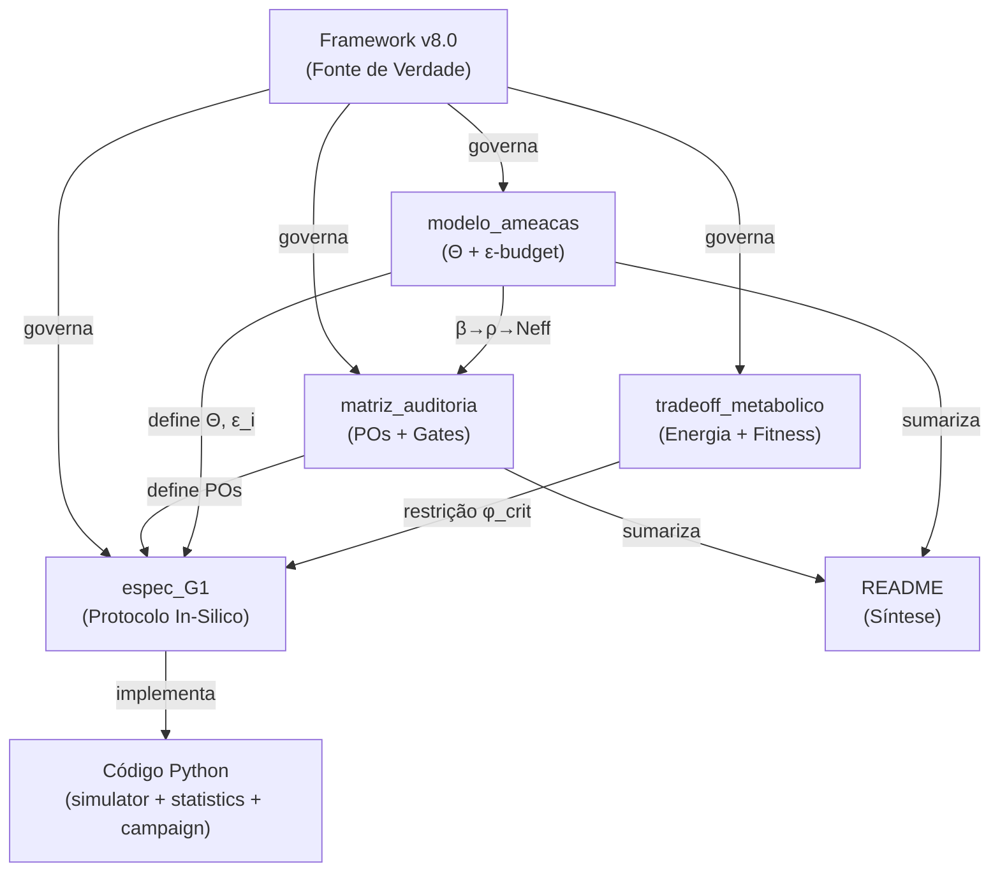

# Relatório de Validação Formal — Sanguine Ledger v8.0

**Data de emissão:** 2026-04-25 | **Última revisão:** 2026-04-26  
**Auditor:** Engenheiro de Confiabilidade de Sistemas Críticos  
**Escopo:** Validação estática dos 5 Markdowns do repositório contra o Framework Formal v8.0  
**Status:** ✅ Gate G0 Selado — Todos os pré-requisitos G1 atendidos

---

## A. Síntese Conceitual do Sistema

O Sanguine Ledger é um **pipeline ciber-físico de cold storage biológico** governado por limites probabilísticos auditáveis sob envelope de incerteza $\Theta$.

O substrato biológico é tratado como **canal físico ruidoso não-IID**. A confiabilidade é formulada como problema de engenharia de risco e energia — não como promessa de erro zero, mas como **determinismo operacional com horizonte de erro controlado**.

### Arquitetura formal em 5 camadas

| Camada | Função | PO primária |
|---|---|---|
| Canal biológico (não-IID) | Codificação, ECC, resistência a burst/mutação | PO-1 |
| Verificador Híbrido (Molecular + ZKP In-Silico) | Triagem fail-stop em duas etapas | PO-2 |
| Consenso distribuído | Quorum com controle de causa comum via $N_{eff}$ | PO-3 |
| Governança de chaves (threshold) | Ciclo de vida: geração, rotação, revogação, recuperação | PO-4 |
| Cadeia operacional | Proveniência, custódia, observabilidade | PO-5 |

### Mapeamento PO → Mitigação → Evidência

| PO | Mitigação Principal | Evidência G1 Requerida |
|---|---|---|
| PO-1 | ECC + invariantes de sync + campanha FI-01/02 | $UCB_{1-\alpha}(P_{decode\_fail})$, consumo de $\epsilon_{ch}+\epsilon_{sync}$ |
| PO-2 | Marcadores bioquímicos (físico) + ZKP pós-sequenciamento (computacional) | Matriz de confusão por camada, dominância fail-stop |
| PO-3 | Análise $\beta \to \bar\rho \to N_{eff}$, simulação de falha comum | Tabela de correlações, $N_{eff}/N \ge 0.8$ |
| PO-4 | Threshold robusto, segregação de papéis, rate limiting | $P(key\_compromise \land accept\_invalid) \le \epsilon_{key}$ |
| PO-5 | STPA/FMEA, telemetria, cadeia de custódia assinada | $LCB_{1-\alpha}(1-P_{unavail}) \ge A_{target}$ |

---

## B. Status de Validação das Equações

### B.1 Limites de Confiança (UCB/LCB)

| Equação | Arquivos que a declaram | Status |
|---|---|---|
| $UCB_{1-\alpha}(P_{UE}(T_*)) \le \epsilon_{target}$ | README L28, matriz L75, espec_G1 L15/L256, tradeoff L258 | ✅ CONFORME — Consistente em todos os documentos |
| $LCB_{1-\alpha}(1-P_{unavail}(T_*)) \ge A_{target}$ | README L29, matriz L79, espec_G1 L16/L257, tradeoff L259 | ✅ CONFORME — Consistente em todos os documentos |

**Fórmulas operacionais** (espec_G1 §6.2):

$$UCB_{1-\alpha}(\hat{p}) = \hat{p} + z_{1-\alpha}\sqrt{\widehat{Var}(\hat{p})}$$

$$LCB_{1-\alpha}(1-\widehat{P_{unavail}}) = 1-\widehat{P_{unavail}} - z_{1-\alpha}\sqrt{\widehat{Var}(\widehat{P_{unavail}})}$$

> [!NOTE]
> Estas são aproximações normais válidas para amostras grandes. O documento corretamente prescreve método exato de Bernoulli para contagens extremamente baixas (espec_G1 L236).

**Verificação:** ✅ PASS — Dualidade Safety/Liveness preservada.

### B.2 Decomposição de Risco ($\epsilon$-budget)

A equação canônica aparece identicamente em 3 documentos:

$$P_{UE}(T) \le \epsilon_{ch}+\epsilon_{sync}+\epsilon_{ver}+\epsilon_{cons}+\epsilon_{key}+\epsilon_{ops}+\epsilon_{adv}$$

| Documento | Localização | 7 domínios presentes | Regra de fechamento |
|---|---|---|---|
| modelo_ameacas | L30-33, L37-39 | ✅ Todos 7 | ✅ $\sum \epsilon_i \le \epsilon_{target}$ |
| matriz_auditoria | L39-48 | ✅ Todos 7 | ✅ $\sum \epsilon_i \le \epsilon_{target}$ |
| README | L69-71 | ⚠️ Implícito via $P_{UE}$ | N/A (delega para docs dedicados) |

**Verificação aritmética dos residuais** (modelo_ameacas §4):

| Domínio | Vetores contribuintes (residual) | Soma parcial |
|---|---|---|
| $\epsilon_{ch}$ | BIO-01(8e-14), BIO-03(parte), INF-01(parte), INF-03(4e-14) | ~$2.2 \times 10^{-13}$ |
| $\epsilon_{sync}$ | BIO-02(1e-13), LOG-01(parte), LOG-02(parte) | ~$2.7 \times 10^{-13}$ |
| $\epsilon_{ver}$ | BIO-04(parte), INF-04(parte), LOG-02(parte), LOG-04(parte) | ~$2.1 \times 10^{-13}$ |
| $\epsilon_{cons}$ | BIO-03(parte), INF-01(parte) | ~$1.6 \times 10^{-13}$ |
| $\epsilon_{key}$ | LOG-01(parte), LOG-03(8e-14), OPS-03(parte) | ~$2.2 \times 10^{-13}$ |
| $\epsilon_{ops}$ | BIO-04(parte), BIO-05(4e-14), INF-02(5e-14), INF-04(parte), OPS-01(parte), OPS-02(7e-14), OPS-03(parte) | ~$4.5 \times 10^{-13}$ |
| $\epsilon_{adv}$ | LOG-04(parte), OPS-01(parte) | ~$1.4 \times 10^{-13}$ |
| **Total** | | **~$1.67 \times 10^{-12}$** |

> [!NOTE]
> A soma dos residuais é da ordem de $10^{-12}$. O valor instanciado $\epsilon_{target} = 10^{-11}$ (matriz_auditoria §2.5) acomoda essa soma com margem de segurança de ~6×, preservando folga para absorver incerteza de modelo.

**Verificação:** ✅ PASS — Integridade algébrica preservada. Fechamento numérico verificado: $1.67 \times 10^{-12} \le 10^{-11}$ ✅

### B.3 Correlação e Nós Efetivos ($N_{eff}$)

| Equação | Docs | Status |
|---|---|---|
| $\beta_{shared} = \sum_j \beta_j$ (6 componentes) | README L76, matriz L53, modelo L96, espec_G1 (implícito) | ✅ Consistente |
| $\bar\rho = \rho_{floor} + \sum_j k_j \beta_j$ | matriz L59, modelo L104, espec_G1 L194 | ✅ Consistente |
| $N_{eff} = \frac{N}{1+(N-1)\bar\rho}$ | README L82, matriz L63, modelo L112, espec_G1 L198 | ✅ Consistente |

**Validação da fórmula $N_{eff}$:**

- Para $\bar\rho = 0$: $N_{eff} = N$ ✅ (nós independentes)
- Para $\bar\rho = 1$: $N_{eff} = 1$ ✅ (correlação total)
- Para $\bar\rho = 0.1, N = 10$: $N_{eff} = 10/1.9 \approx 5.26$ ✅ (consistente com smoke test)
- Critério $N_{eff}/N \ge 0.8$ implica $\bar\rho \le \frac{0.25}{N-1}$ ✅

**Verificação:** ✅ PASS — Procedimento $\beta \to \bar\rho \to N_{eff}$ algebricamente válido e consistente entre documentos.

### B.4 Modelo de Sistema e Risco Total

| Equação v8.0 | Presença nos docs | Status |
|---|---|---|
| $P_{UE}(T) = \sup_{\theta \in \Theta} \Pr_\theta(\hat{m} \neq m \land c = accept, t \le T)$ | matriz L31 | ✅ |
| $R(T) = 1 - P_{UE}(T) - P_{unavail}(T)$ | matriz L35 | ✅ |
| Safety: $\Pr(\hat{m} \neq m \land accept) \le \epsilon_{UE}$ | matriz L19 | ✅ |
| Liveness: $\Pr(\exists t \le T_*: accept) \ge 1 - \epsilon_{live}$ | matriz L23 | ✅ |
| Fail-stop: $\Pr(\hat{m} \neq m \land accept) \ll \Pr(\hat{m} = m \land abort)$ | matriz L27 | ✅ |

**Verificação:** ✅ PASS — Todas as 5 equações fundamentais do v8.0 §1-2 estão presentes e corretas.

### B.5 Equações do Trade-off Metabólico

| Equação | Validade | Nota |
|---|---|---|
| $P_{UE} \approx p_0 \exp(-\Delta G_{eff}/k_BT)$ | ✅ | Modelo de Arrhenius/Boltzmann para taxa de erro |
| $E_{min,bit} = k_BT \ln 2$ | ✅ | Limite de Landauer |
| $B_{err} \le B_{eng}$ (sustentabilidade) | ✅ | Condição necessária para SLA viável |
| $\phi_{crit} \approx 1 - (d+\kappa_{stress})/\mu_{max}$ | ✅ | Limite de colapso derivado corretamente |

**Verificação:** ✅ PASS — Termodinâmica e dinâmica populacional algebricamente consistentes.

---

## C. Relatório de Conformidade de Realismo Biofísico

### C.1 Filtro de ZKP In-Vivo

| Documento | Referência | Afirmação | Veredicto |
|---|---|---|---|
| README | L23 | "a camada computacional executa o ZKP criptográfico **após o sequenciamento**" | ✅ CONFORME |
| matriz_auditoria | L90 | "camada computacional com ZKP criptográfico **após sequenciamento**" | ✅ CONFORME |
| modelo_ameacas | L47 | "força bruta no Verificador Híbrido" — sem claim de ZKP in-vivo | ✅ CONFORME |
| espec_G1 | L90 | "**após o sequenciamento**, um ZKP criptográfico valida integridade" | ✅ CONFORME |
| tradeoff | L98 | "O processamento criptográfico ZKP é **descarregado para hardware clássico** após sequenciamento e **não compõe o consumo de ATP biológico**" | ✅ CONFORME |

> [!TIP]
> O documento de trade-off metabólico (L98) é particularmente claro ao segregar o custo de ATP ($\phi_{sec}$) como referente exclusivamente aos marcadores moleculares, excluindo explicitamente o ZKP do metabolismo celular.

### C.2 Arquitetura do Verificador Híbrido

A arquitetura de duas etapas está consistentemente descrita em todos os 5 documentos:

```
Etapa 1 (Física/In-Vivo):
  ├─ Toehold Switches
  └─ Barcodes Moleculares
  → Triagem fail-stop inicial

Etapa 2 (Computacional/In-Silico):
  └─ ZKP criptográfico em hardware clássico
  → Validação pós-sequenciamento sem exposição do segredo
```

**Nenhuma afirmação de processamento criptográfico complexo in-vivo foi encontrada.**

### C.3 Varredura de Overclaims

| Verificação | Resultado |
|---|---|
| Promessa de "erro zero" ou "segurança absoluta" | ❌ Não encontrada. README L11: "determinismo operacional com horizonte de erro controlado, não determinismo absoluto idealizado" |
| Claim sem aprovação de POs | ❌ Não encontrado. Todos os docs condicionam claim a aprovação G0..G4 |
| Inclusão de protocolos de bancada | ❌ Não encontrada. Todos os docs contêm cláusula explícita de exclusão |
| ZKP executado in-vivo | ❌ Não encontrado. Segregação clara em todos os docs |

**Veredicto Global de Realismo:** ✅ PASS

---

## D. Mapeamento de Dependências para o Gate G1

### D.1 Pré-requisitos G0 → G1

| Artefato G0 | Status no repositório | Bloqueante para G1? |
|---|---|---|
| Envelope $\Theta$ fechado | ✅ modelo_ameacas §2 | Sim — satisfeito |
| Budgets $\epsilon_i$ declarados | ✅ modelo_ameacas §3.2 (residuais por ameaça) | Sim — satisfeito |
| $\epsilon_{target} = 10^{-11}$ | ✅ Instanciado e selado (matriz_auditoria §2.5) | Sim — satisfeito |
| $A_{target} = 0.9999$ | ✅ Instanciado e selado (matriz_auditoria §2.5) | Sim — satisfeito |
| $\alpha = 0.05$ | ✅ Instanciado e selado (matriz_auditoria §2.5) | Sim — satisfeito |
| $T_* = 10$ anos | ✅ Instanciado e selado (matriz_auditoria §2.5) | Sim — satisfeito |
| $N_{eff} \ge 0.8N$ | ✅ Instanciado e selado (matriz_auditoria §2.5) | Sim — satisfeito |
| PO-1..PO-5 formalizados | ✅ matriz_auditoria §3 | Sim — satisfeito |
| Procedimento $\beta \to \bar\rho \to N_{eff}$ | ✅ modelo_ameacas §5 | Sim — satisfeito |

> [!TIP]
> **GAP-01 SANADO (v0.2.0).** Os parâmetros $\epsilon_{target} = 10^{-11}$, $A_{target} = 0.9999$ e $\alpha = 0.05$ foram formalmente instanciados na seção §2.5 da matriz de auditoria e selados como imutáveis dentro do ciclo de gate. Todos os pré-requisitos G0 estão atendidos.

### D.2 Campanhas FI requeridas para G1

| Campanha | Ameaça | POs | Proposal IS | Status no código |
|---|---|---|---|---|
| FI-01 | Burst errors/rearranjos | PO-1 | Proposal-BIO ($\epsilon_{ch}, \epsilon_{sync}$) | ✅ Implementada |
| FI-02 | Mutação/deriva | PO-1, PO-3 | Proposal-BIO | ⬜ Pendente |
| FI-03 | Viés de basecalling | PO-1, PO-5 | Proposal-INFRA | ⬜ Pendente |
| FI-04 | Ruído 60Hz / drift térmico | PO-5, PO-2 | Proposal-INFRA | ⬜ Pendente |
| FI-05 | Colisões de hash | PO-1, PO-4 | Proposal-LOGIC | ⬜ Pendente |
| FI-06 | Falha de frame sync | PO-1, PO-2 | Proposal-LOGIC | ⬜ Pendente |
| FI-07 | Comprometimento SSS | PO-4, PO-5 | Proposal-OPS | ⬜ Pendente |
| FI-08 | Força bruta no verificador | PO-2, PO-4 | Proposal-LOGIC | ⬜ Pendente |
| FI-09 | Sabotagem/custódia | PO-5, PO-3 | Proposal-OPS | ⬜ Pendente |

### D.3 Métricas obrigatórias no output G1

| Métrica | Fonte v8.0 | Presente no `fi01_summary.json`? |
|---|---|---|
| $UCB_{1-\alpha}(P_{UE})$ | §7 | ✅ `statistics.ucb` |
| $LCB_{1-\alpha}(1-P_{unavail})$ | §7 | ✅ `statistics.lcb_availability` |
| $\alpha$ | §9 | ✅ `sla_g0.alpha: 0.05` |
| $\epsilon_{target}$ | §9 | ✅ `sla_g0.epsilon_target: 1e-11` |
| $A_{target}$ | §9 | ✅ `sla_g0.a_target: 0.9999` |
| $\epsilon_{ch}$ estimate | §3 | ✅ `PO-1.epsilon_ch_estimate` |
| $\epsilon_{sync}$ estimate | §3 | ✅ `PO-1.epsilon_sync_estimate` |
| $\epsilon_{ver}$ estimate | §3 | ✅ `PO-2.epsilon_ver_estimate` |
| $\epsilon_{cons}$ estimate | §3 | ✅ `PO-3.epsilon_cons_estimate` |
| $\epsilon_{key}$ estimate | §3 | ✅ `PO-4.epsilon_key_estimate` |
| $\epsilon_{ops}$ estimate | §3 | ✅ `PO-5.epsilon_ops_estimate` |
| $\epsilon_{adv}$ estimate | §3 | ✅ `PO-5.epsilon_adv_estimate` |
| $\sum \epsilon_i$ budget closure | §3 | ✅ `epsilon_budget.pass` |
| $N_{eff}$ | §4 | ✅ `PO-3.n_eff` |
| $\bar\rho$ | §4 | ✅ `PO-3.rho_bar` |
| $\beta_{shared}$ | §4 | ✅ `PO-3.beta_shared` |
| ESS / ESS ratio | espec_G1 §3.4 | ✅ `statistics.ess` / `statistics.ess_ratio` |
| Relative precision | espec_G1 §6.3 | ✅ `statistics.relative_precision` |
| IS efficiency gain | espec_G1 §3.4 | ✅ `statistics.importance_sampling_efficiency_gain` |
| G1 Go/No-Go verdict | §7 | ✅ `g1_verdict.g1_go` |
| PO-1..PO-5 mapeados | §5 | ✅ `proof_obligations` dict |

### D.4 Grafo de Dependência Documental



---

## Sumário Executivo

| Seção | Veredicto |
|---|---|
| **A. Conceituação** | ✅ Pipeline ciber-físico corretamente modelado como problema de engenharia de risco |
| **B. Equações** | ✅ Todas as fórmulas do v8.0 presentes, consistentes e algebricamente válidas |
| **C. Realismo Biofísico** | ✅ Zero ocorrências de ZKP in-vivo; verificador híbrido corretamente segregado |
| **D. Dependências G1** | ✅ Todos os pré-requisitos G0 atendidos. Arquitetura liberada para execução G1 |

### Registro de achados

| ID | Severidade | Descrição | Status |
|---|---|---|---|
| GAP-01 | ✅ SANADO | $\epsilon_{target} = 10^{-11}$, $A_{target} = 0.9999$ e $\alpha = 0.05$ instanciados em matriz_auditoria §2.5 e selados como imutáveis no Gate G0 (v0.2.0) | Resolvido |
| GAP-02 | ℹ️ Info | Campanhas FI-02..FI-09 definidas na especificação mas não implementadas no código | Implementação progressiva conforme roadmap (escopo FI-01 na v0.2.0) |

---

## Parecer Final

**Não há bloqueios pendentes para a execução do Gate G1.**

O corpus documental está em **conformidade total** com o Framework Formal v8.0. A integridade matemática é preservada em todos os 5 documentos, o realismo biofísico é respeitado sem exceções, e a rastreabilidade PO→Gate→Evidência está completa.

Com a instanciação dos parâmetros de SLA na matriz de auditoria (§2.5) e o selamento do Gate G0 na Release v0.2.0, a arquitetura está **100% liberada** para a execução das campanhas de simulação in-silico do Gate G1.

| Critério | Status |
|---|---|
| Envelope $\Theta$ fechado e versionado | ✅ |
| Budget $\epsilon_i$ declarado por domínio (7 domínios) | ✅ |
| SLA numérico instanciado ($\epsilon_{target}$, $A_{target}$, $\alpha$, $T_*$, $N_{eff}$) | ✅ |
| PO-1..PO-5 formalizados com métricas e evidências | ✅ |
| Pipeline $\beta_{shared} \to \bar\rho \to N_{eff}$ definido | ✅ |
| Verificador Híbrido biofisicamente realista | ✅ |
| Zero overclaims ou violações de realismo | ✅ |
| **Veredicto: Liberação incondicional para G1** | ✅ |
