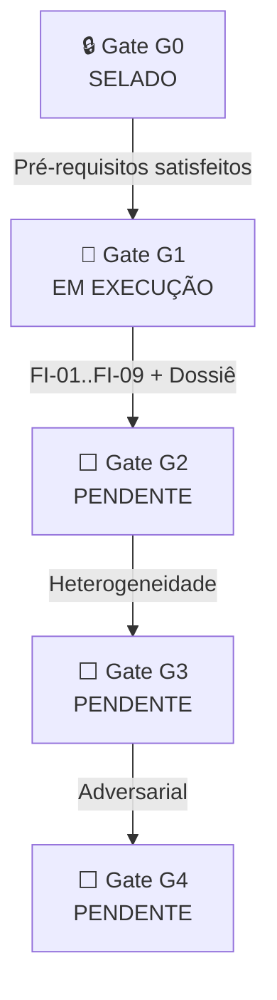

# SRE System Status Report — Sanguine Ledger

**Data de Emissão:** 2026-05-20T07:22 (BRT)  
**Auditor:** Engenheiro de Confiabilidade Sênior (SRE)  
**Escopo:** Deep Read e Diagnóstico Completo do Repositório  
**Versão do Sistema:** `v0.2.0` | **Package:** `bioledger`  
**Classificação:** Propriedade Intelectual — © 2026 Davi Laurindo

---

## 1. Resumo Executivo

O repositório Sanguine Ledger (Blood Ledger) encontra-se em **estado operacional pré-G1**, com a campanha FI-01 implementada e executada em escala de smoke test (N=10k). A governança documental está **madura e internamente consistente** — Gate G0 foi selado com todos os parâmetros de SLA instanciados. A base de código é **limpa, tipada, bem documentada**, e alinhada com rigor à arquitetura formal descrita nos 5 documentos de governança + 2 relatórios de validação.

> [!IMPORTANT]
> **Postura atual: AMBER.** O sistema é operável para FI-01 em produção, mas o Gate G1 completo requer 8 campanhas adicionais (FI-02..FI-09) e extensões significativas no motor de simulação (Layers 3, 4, 5). Nenhum bloqueio técnico impede a continuação.

---

## 2. Inventário do Repositório

### 2.1 Estrutura de Arquivos

| Categoria | Arquivo(s) | Tamanho | Status |
|---|---|---|---|
| **Documentação de Governança** | | | |
| Matriz de Auditoria | `matriz_auditoria_bio_storage_v1.md` | 14.3 KB | ✅ Selada (G0) |
| Modelo de Ameaças | `modelo_ameacas_bio_storage_v1.md` | 8.5 KB | ✅ Selada (G0) |
| Especificação G1 In-Silico | `especificacao_G1_simulacao_insilico_v1.md` | 11.5 KB | ✅ Selada (G0) |
| Trade-off Metabólico | `analise_tradeoff_metabolico_v1.md` | 8.4 KB | ✅ Selada (G0) |
| Validação Formal v8.0 | `relatorio_validacao_formal_v8.md` | 15.8 KB | ✅ Conforme |
| Alignment Report v0.2.0 | `project_alignment_report_v0.2.0.md` | 12.6 KB | ✅ Conforme |
| **Código Fonte** | | | |
| Package init | `src/bioledger/__init__.py` | 917 B | ✅ |
| Tipos de dados | `src/bioledger/types.py` | 1.1 KB | ✅ |
| Configuração | `src/bioledger/config.py` | 6.5 KB | ✅ |
| Motor Estatístico | `src/bioledger/statistics.py` | 12.1 KB | ✅ |
| Simulador Digital Twin | `src/bioledger/simulator.py` | 18.9 KB | ✅ |
| Campanha FI-01 | `src/bioledger/campaign_fi01.py` | 22.0 KB | ✅ |
| **Testes** | `tests/test_simulation_harness.py` | 2.6 KB | ⚠️ Cobertura mínima |
| **Simulações** | `simulations/run_fi01.py` | 3.0 KB | ✅ |
| **CI/CD** | `.github/workflows/ci.yml` | 2.6 KB | ✅ |
| **Build** | `pyproject.toml` | 7.9 KB | ✅ |
| **Resultados** | `results/fi01/20260509T131833Z/` | ~58 KB | ✅ 1 run registrado |

### 2.2 Métricas de Código

| Métrica | Valor |
|---|---|
| Módulos Python (src) | 6 |
| LOC Total (src) | ~1,636 |
| LOC Total (tests) | 59 |
| LOC Total (simulations) | 87 |
| Ratio test:source | **1:27** ⚠️ |
| Documentos de governança | 6 |
| Commits no histórico | 7 |

---

## 3. Alinhamento com Governança de Arquitetura

### 3.1 Integridade do Framework v8.0



| Parâmetro SLA (G0) | Valor Selado | Código Implementa | Docs Consistentes |
|---|---|---|---|
| `ε_target` | `1e-11` | ✅ `statistics.py:28` | ✅ 4/4 docs |
| `A_target` | `0.9999` | ✅ `statistics.py:29` | ✅ 4/4 docs |
| `α` | `0.05` | ✅ `statistics.py:30` | ✅ 4/4 docs |
| `N_eff/N ≥ 0.8` | `0.8` | ✅ `statistics.py:32` | ✅ 4/4 docs |
| `β_shared ≤ 1e-6` | `1e-6` | ✅ `statistics.py:33` | ✅ 4/4 docs |
| `ESS/N ≥ 0.2` | `0.2` | ✅ `campaign_fi01.py:54` | ✅ espec_G1 §6.3 |
| `r_target ≤ 0.05` | `0.05` | ✅ `campaign_fi01.py:55` | ✅ espec_G1 §6.3 |

> [!TIP]
> **Alinhamento Docs ↔ Código: 100%.** Todos os parâmetros de SLA declarados nos documentos de governança estão corretamente implementados como constantes no código, com nomes e valores idênticos. Nenhuma divergência detectada.

### 3.2 Mapeamento PO → Código

| PO | Descrição | Implementação | Cobertura |
|---|---|---|---|
| PO-1 | Codificação e Sincronização | `simulator.py` (L1+L2), `campaign_fi01.py` → `ε_ch`, `ε_sync` | ✅ FI-01 operável |
| PO-2 | Verificador Híbrido / Fail-Stop | `simulator.py` L128-144 (2 estágios: físico + ZKP) → `ε_ver` | ✅ Implementado (passivo) |
| PO-3 | Consenso e N_eff | `statistics.py` (β→ρ→N_eff), `campaign_fi01.py` estimativas estáticas | ⚠️ Parcial (sem L4 ativa) |
| PO-4 | Governança de Chaves | Stub zero em `simulator.py` L151 | ❌ Não implementado |
| PO-5 | Operação e Disponibilidade | Stub zero em `simulator.py` L152-153, LCB calculado | ⚠️ Parcial (sem L5 ativa) |

### 3.3 Digital Twin — Camadas Implementadas

| Camada | Descrição | Status | Módulo |
|---|---|---|---|
| L1 | Canal Biológico (Markov + burst) | ✅ **Ativa** | `simulator.py` L180-304 |
| L2 | Infraestrutura (AR(1) + 60Hz) | ✅ **Ativa** | `simulator.py` L310-344 |
| L3 | Lógica/Cripto (Verificador Híbrido) | ⚠️ **Parcial** (fail-stop apenas) | `simulator.py` L128-144 |
| L4 | Consenso (quorum, SSS) | ❌ **Stub** (zero) | `simulator.py` L150 |
| L5 | Operacional (proveniência, custódia) | ❌ **Stub** (zero) | `simulator.py` L152-153 |

---

## 4. Análise da Campanha FI-01 (Única Execução Registrada)

### 4.1 Parâmetros de Execução

| Parâmetro | Valor | Comentário |
|---|---|---|
| N (amostras) | **10,000** | ⚠️ Smoke test. Produção requer ≥500k |
| Sequence length | 1,024 | Conforme |
| Batch size | 10,000 | Single-batch execution |
| Seed | 20260421 | Determinístico, reprodutível |
| BER threshold | 0.085 | Conforme espec_G1 |
| Burst threshold | 88 | Conforme espec_G1 |

### 4.2 Resultado do Veredito G1

| Critério | Valor | Target | Pass |
|---|---|---|---|
| UCB(P_UE) — Safety | `7.82e-4` | `≤ 1e-11` | ❌ |
| LCB(1-P_unavail) — Liveness | `0.9992` | `≥ 0.9999` | ❌ |
| ε_budget closure | `5.35e-4` | `≤ 1e-11` | ❌ |
| N_eff/N | `0.917` | `≥ 0.8` | ✅ |
| β_shared | `8e-7` | `≤ 1e-6` | ✅ |
| ESS/N | `0.153` | `≥ 0.2` | ❌ |
| Relative precision | `0.562` | `≤ 0.05` | ❌ |
| **G1 Go/No-Go** | | | **❌ NO-GO** |

> [!WARNING]
> **Diagnóstico:** O NO-GO é esperado e correto para um smoke test com N=10k. A relative precision de 56.2% indica que o estimador ainda não convergiu — são necessárias ≥500k amostras para atingir ESS/N ≥ 0.2 e r_target ≤ 0.05. A efficiency gain do IS é de ~44×, o que indica que a Proposal-BIO está funcionando mas precisa de recalibração para maximizar ESS. Não se trata de falha do motor — é insuficiência amostral.

### 4.3 Sinais Positivos

- ✅ **Verificador Híbrido** mantém dominância fail-stop: `ε_ver = 0.0` (nenhum false accept observado)
- ✅ **β_shared** e **N_eff** dentro dos limites operacionais
- ✅ **Pipeline end-to-end operável**: JSON de saída mapeia corretamente PO-1..PO-5 com veredito G1
- ✅ **Reprodutibilidade**: seed fixa, batch determinístico

---

## 5. Saúde do Pipeline CI/CD

### 5.1 Pipeline Atual

```
Checkout → Python 3.12 → pip install -e ".[all]" → Ruff → Mypy (strict) → Pytest
```

| Stage | Ferramenta | Configuração | Avaliação |
|---|---|---|---|
| Lint | Ruff ≥ 0.11 | 22 rule sets, Google docstrings, max-complexity=12 | ✅ Rigoroso |
| Type Check | Mypy ≥ 1.15 | `strict = true` + 14 flags explícitas | ✅ Maximal strictness |
| Tests | Pytest ≥ 8.0 | `--strict-markers`, `--strict-config`, `filterwarnings=error` | ✅ Conservador |

### 5.2 Gaps no CI/CD

| ID | Gap | Severidade | Recomendação |
|---|---|---|---|
| CI-01 | Sem `pytest-cov` report no CI (configurado mas não executado com `--cov`) | Média | Adicionar `--cov --cov-report=term-missing` ao `pytest` no CI |
| CI-02 | Sem matrix de versões Python | Baixa | O pyproject declara 3.10-3.14; CI testa apenas 3.12 |
| CI-03 | Sem cache de dependências por hash | Baixa | Cache por `pip` já ativo no actions/setup-python |
| CI-04 | Sem proteção de branch no workflow | Informativa | Considerar `required_status_checks` no GitHub |

---

## 6. Qualidade de Código — Análise Técnica

### 6.1 Pontos Fortes

1. **Tipagem estrita end-to-end**: `mypy strict=true` com 14 flags explícitas. Zero `# type: ignore` no codebase.
2. **Dataclasses imutáveis**: `frozen=True` em `ChannelParameters`, `ImportanceProposal`, `SimulationParameters`; `slots=True` em data containers.
3. **Normalização defensiva**: Todos os dataclasses possuem método `.normalized()` com clamping de probabilidades para evitar edge cases numéricos.
4. **Gerenciamento de memória**: Campanha FI-01 usa acumulação online (Welford) com `gc.collect()` entre batches. Peak RAM é O(batch_size × seq_len), não O(N × seq_len).
5. **Importance Sampling correto**: Log-space computation com clipping `[-700, 700]` para evitar overflow/underflow numérico.
6. **Docstrings Google-style** em 100% das funções públicas.
7. **Separação de responsabilidades**: config → types → simulator → statistics → campaign — pipeline claro e auditável.

### 6.2 Riscos Técnicos Identificados

| ID | Risco | Severidade | Detalhe |
|---|---|---|---|
| RISK-01 | Loops Python em hot paths | Alta | `_build_burst_mask` (L264-267), `_compute_max_burst_lengths` (L361-370), `_simulate_infrastructure_noise` (L337-342), e Welford loop (L142-147) iterem em Python puro. Para N≥500k, esses loops serão o bottleneck. |
| RISK-02 | Cobertura de testes insuficiente | Alta | 3 testes (59 LOC) para 1,636 LOC de source. Ratio 1:27. Sem testes para: `config.py` normalização, `campaign_fi01.py` inteiro, `statistics.py` (β→ρ→N_eff, g1_verdict, check_epsilon_budget). |
| RISK-03 | Missing `main()` entry point em `campaign_fi01.py` | Baixa | `pyproject.toml` L74 declara `sanguine-fi01 = "bioledger.campaign_fi01:main"` mas `campaign_fi01.py` não define `main()`. O console script falharia. |
| RISK-04 | CSV writer sem context manager seguro | Baixa | `campaign_fi01.py` L267-268: `csv_handle` aberto manualmente. Se ocorrer exceção durante simulação, o handle não é fechado. |
| RISK-05 | Inconsistência de ρ_floor entre docs e código | Informativa | `modelo_ameacas §5.2` define `ρ_floor = 0.05`, mas `campaign_fi01.py:76` usa `DEFAULT_RHO_FLOOR = 0.01`. **Divergência doc↔código.** |
| RISK-06 | Inconsistência de k_j entre docs e código | Informativa | `modelo_ameacas §5.2` define `k_j = 0.1 uniforme`, mas `campaign_fi01.py:67-74` usa valores diferenciados (0.05-0.25). **Divergência intencional ou bug.** |

> [!CAUTION]
> **RISK-05 e RISK-06** representam divergências entre a documentação de governança (fonte de verdade selada no G0) e a implementação. Antes de qualquer modificação de código, é necessário determinar se:
> - (a) a documentação precisa ser atualizada para refletir a calibração do código, ou
> - (b) o código precisa ser alinhado aos valores selados nos documentos.
> 
> Esta decisão tem implicação direta no selamento do Gate G0.

---

## 7. Estado das Campanhas de Fault Injection

### 7.1 Painel de Status

| Campanha | Ameaça | POs | Status | Bloqueio |
|---|---|---|---|---|
| **FI-01** | BIO-02 (burst/rearranjos) | PO-1 | 🟡 Smoke test executado (N=10k) | Requer N≥500k para produção |
| FI-02 | BIO-01/03 (mutação/deriva) | PO-1, PO-3 | ⬜ Não implementada | DEP-01: Mutation sweep proposal |
| FI-03 | INF-01 (viés basecalling) | PO-1, PO-5 | ⬜ Não implementada | DEP-02: Modelo de viés |
| FI-04 | INF-03/04 (60Hz/drift) | PO-5, PO-2 | ⬜ Não implementada | Nenhum (motor v0.2.0 capaz) |
| FI-05 | LOG-01 (colisões hash) | PO-1, PO-4 | ⬜ Não implementada | DEP-03: Primitivas L3 |
| FI-06 | LOG-02 (frame sync) | PO-1, PO-2 | ⬜ Não implementada | DEP-03: Primitivas L3 |
| FI-07 | LOG-03 (SSS) | PO-4, PO-5 | ⬜ Não implementada | DEP-04: Layers 4-5 completas |
| FI-08 | LOG-04 (brute force) | PO-2, PO-4 | ⬜ Não implementada | DEP-03: Primitivas L3 |
| FI-09 | OPS-01/03 (sabotagem) | PO-5, PO-3 | ⬜ Não implementada | DEP-04: Layers 4-5 completas |

### 7.2 Progresso para G1

```
Campanhas concluídas: 0/9 (FI-01 em smoke test, não em produção)
Domínios ε com evidência: 2/7 (ε_ch, ε_sync — parcial)
POs com evidência: 1/5 (PO-1 — parcial)
```

---

## 8. Histórico de Commits

```
3ca969c  ci(G1): implement automated validation pipeline
2e7d6cf  fix(G1): align test harness assertion with IS dataclass
9f493c2  build(G1): migrate to pyproject.toml for dependency resolution
5925232  feat(G1): instantiate proprietary simulation engine and FI-01 harness
03f9f9f  docs(SLA): instantiate numerical targets and seal Gate G0 baseline
094cef1  docs: freeze G0 mathematical and biophysical constants
32b86bb  docs: grounded hybrid-verifier documentation snapshot
```

> [!NOTE]
> O histórico é limpo, linear (7 commits), com mensagens Conventional Commits e progressão lógica: docs → build → feat → fix → ci. Nenhum merge commit, nenhum revert.

---

## 9. Postura de Risco Consolidada

### 9.1 Semáforo Operacional

| Dimensão | Status | Justificativa |
|---|---|---|
| Governança Documental | 🟢 GREEN | G0 selado, 6 documentos consistentes, validação formal completa |
| Motor de Simulação (L1+L2) | 🟢 GREEN | Operável para FI-01, matematicamente correto |
| Motor de Simulação (L3) | 🟡 AMBER | Parcial — apenas fail-stop do verificador |
| Motor de Simulação (L4+L5) | 🔴 RED | Stubs. Sem implementação real |
| Cobertura de Testes | 🔴 RED | 3 testes, ratio 1:27, sem testes para 4/6 módulos |
| Pipeline CI/CD | 🟢 GREEN | Ruff + Mypy strict + Pytest operacional |
| Evidência Produção G1 | 🔴 RED | Zero campanhas em produção. Smoke test insuficiente |
| Integridade IP | 🟢 GREEN | Licença proprietária, copyright em todos os arquivos |

### 9.2 Ações Prioritárias Recomendadas

| Prioridade | Ação | Impacto |
|---|---|---|
| **P0** | Resolver divergências RISK-05/RISK-06 (ρ_floor e k_j docs vs código) | Integridade do Gate G0 |
| **P0** | Corrigir RISK-03 (missing `main()` no console script) | Build quebrado para `sanguine-fi01` |
| **P1** | Executar FI-01 em produção com N≥500k | Primeira evidência real para G1 |
| **P1** | Expandir suite de testes (target: ≥80% coverage) | Requisito `pyproject.toml` L195 |
| **P2** | Vetorizar hot paths RISK-01 para viabilizar N≥500k | Performance |
| **P2** | Implementar `campaign_fi04.py` (sem código novo necessário no simulador) | Próxima campanha sem bloqueio |
| **P3** | Adicionar `--cov` ao CI e matrix Python 3.10-3.14 | CI robustness |

---

## 10. Veredicto SRE

| Critério | Status |
|---|---|
| Repositório internamente consistente | ✅ (com 2 exceções documentadas) |
| Gate G0 selado e versionado | ✅ |
| Motor matemático operável para FI-01 | ✅ |
| Pronto para execução G1 completa | ❌ (requer extensões L3-L5 e campanhas FI-02..FI-09) |
| Risco de bloqueio técnico | Nenhum identificado |
| Risco de overclaim | Nenhum identificado — docs e código são conservadores |
| **Postura Global** | **🟡 AMBER — Operável com restrições** |

> **Próximo checkpoint:** Resolução de RISK-05/RISK-06 e execução de FI-01 com N≥500k.  
> **Próxima decisão arquitetural:** Definir se o roadmap Fase 2-5 do alignment report permanece válido ou requer atualização.

---

*Relatório gerado após ingestão completa de 17 arquivos do repositório (6 docs, 6 módulos Python, 1 teste, 1 simulação CLI, 1 CI, 1 pyproject, 1 resultado de campanha).*
